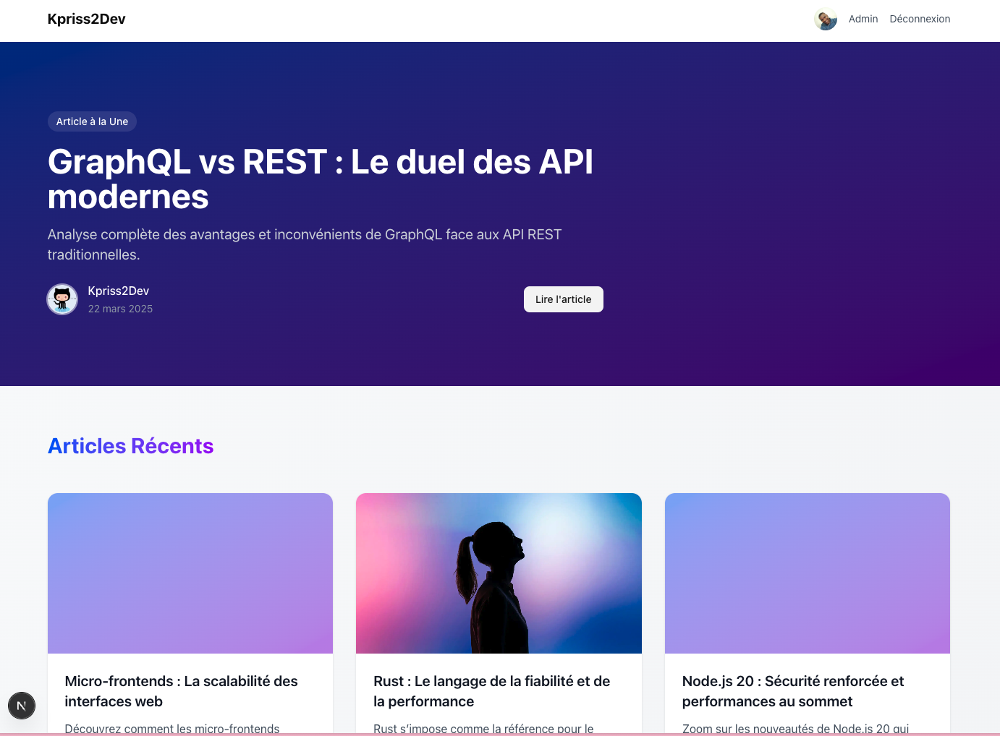

# Simple Blog System

Un système de blog moderne construit avec Next.js , TypeScript, et Prisma.

## Captures d'écran

### Page d'accueil


### Grille d'article


### Détail d'un article


## Fonctionnalités

- Authentification avec NextAuth.js
- Interface utilisateur moderne avec Tailwind CSS
- Base de données sqlite avec Prisma
- Tests avec Vitest

## Prérequis

- Node.js 18+
- npm ou pnpm

## Installation

1. Cloner le projet
2. Installer les dépendances :
```bash
npm install
# ou
pnpm install
```

3. Configurer les variables d'environnement :
   Copier `.env.local.example` vers `.env.local` et remplir les variables requises

4. Initialiser la base de données :
```bash
npm run db:push
npm run seed
```

## Développement

Lancer le serveur de développement :

```bash
npm run dev
# ou
pnpm dev
```

Ouvrir [http://localhost:3000](http://localhost:3000) dans votre navigateur.

## Scripts disponibles

- `npm run dev` - Lance le serveur de développement
- `npm run build` - Construit l'application pour la production
- `npm run start` - Lance l'application en production
- `npm run test` - Lance les tests
- `npm run seed` - Remplit la base de données avec des données de test
- `npm run db:push` - Met à jour le schéma de la base de données
- `npm run db:client` - Génère le client Prisma

## Technologies principales

- [Next.js](https://nextjs.org)
- [TypeScript](https://www.typescriptlang.org)
- [Prisma](https://www.prisma.io)
- [NextAuth.js](https://next-auth.js.org)
- [Tailwind CSS](https://tailwindcss.com)
- [Vitest](https://vitest.dev)
